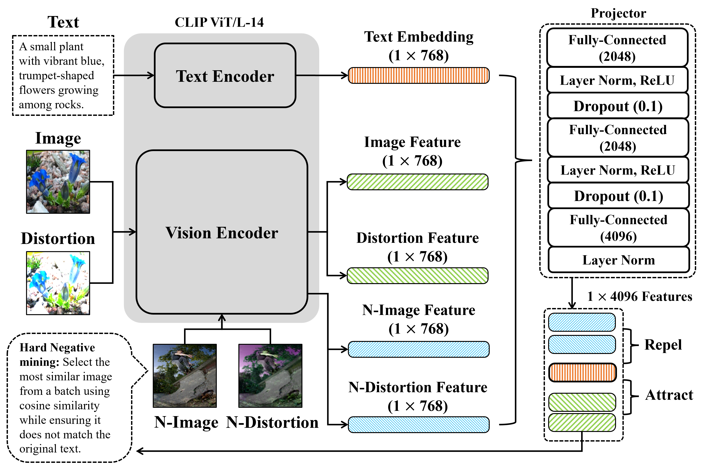

# 🖼️ Text‑Guided Invariant Feature Learning for Robust Image Watermarking

Official implementation of our paper:

**Text‑Guided Image Invariant Feature Learning for Robust Image Watermarking**  
*Muhammad Ahtesham · Xin Zhong*
https://arxiv.org/pdf/2503.13805

---

## Introduction

Ensuring robustness in image watermarking is crucial for and maintaining content integrity under diverse transformations. Recent self-supervised learning (SSL) approaches, such as DINO, have been leveraged for watermarking but primarily focus on general feature representation rather than explicitly learning invariant features. In this work, we propose a novel text-guided invariant feature learning framework for robust image watermarking. Our approach leverages CLIP's multimodal capabilities, using text embeddings as stable semantic anchors to enforce feature invariance under distortions. We evaluate the proposed method across multiple datasets, demonstrating superior robustness against various image transformations. Compared to state-of-the-art SSL methods, our model achieves higher cosine similarity in feature consistency tests and outperforms existing watermarking schemes in extraction accuracy under severe distortions. These results highlight the efficacy of our method in learning invariant representations tailored for robust deep learning-based watermarking.

---

## 🔍 Model Architecture Overview



---

## 📦 Dataset
We train and evaluate on the **Flickr8k dataset**:

- 📷 ~8,000 images  
- 📝 5 captions per image (~40,000 pairs)  
- 🔗 [Download Flickr8k](https://github.com/jbrownlee/Datasets/releases/download/Flickr8k/Flickr8k_Dataset.zip)  

---

## ⚙️ Setup
```bash
pip install -r requirements.txt
```
---

## 🚀 Usage
1) Put Flickr8k images in `Images/` and captions in `captions.txt`.  
2) Train:
```bash
python main.py
```
Checkpoints will be saved to `clip_model_F/`.

---

## 🧠 Method (1‑minute summary)
- **Frozen CLIP encoders** extract image/text embeddings.  
- **Projection heads (4096‑D)** map to a robust space.  
- **Text as anchor**: original & distorted images are aligned to the same caption.  
- **Losses**: contrastive + feature decorrelation.  
- **Hard negatives** mined within batch to improve discrimination.

---

## 📝 Citation
If you use this repository, please cite:
```bibtex
@article{ahtesham2025textguided,
  title={Text-Guided Image Invariant Feature Learning for Robust Image Watermarking},
  author={Muhammad Ahtesham and Xin Zhong},
  journal={arXiv preprint arXiv:2503.13805},
  year={2025}
}
```

---

## 🙏 Acknowledgements
Built on [OpenAI CLIP](https://github.com/openai/CLIP). Dataset: Flickr8k.
